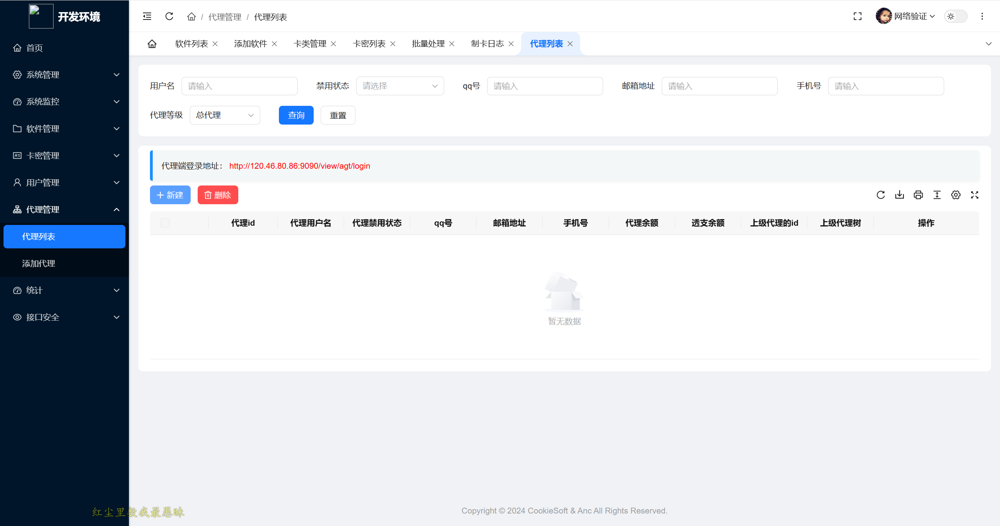

<h1 align="center" style="margin: 30px 0 30px; font-weight: bold;">CookieSoft-GoVerify v1.0.0</h1>
<h4 align="center">基于 gin+Vue 的跨平台个人版网络验证</h4>

项目文档地址：https://va17636oux.apifox.cn/doc-5218282

## 项目介绍

🎉 基于Go，gin，JWT，vue前后端分离的权限管理系统

* 前端采用Vue3 & ElementUIPlus
* 后端采用go、gin & Jwt & gorm & mysql & copier & redis & gin-cache 。
* 权限认证使用Jwt，支持多终端认证系统。

## 安装

请查看安装文档，在文档中会具体介绍

## 启动

```shell
# 读写权限
chmod 777 cookie-network-verify-linux 
# 启动
./cookie-network-verify-linux
```
## 演示图


|  开发端   | 系统运行截图    |
| --- | --- |
|     |     |
|     |     |
|     |     |
|     |     |
|     |     |

> 代理端更多功能等你探索！！！

欢迎加入群聊

QQ群聊：559503921
开发者：3130894126

